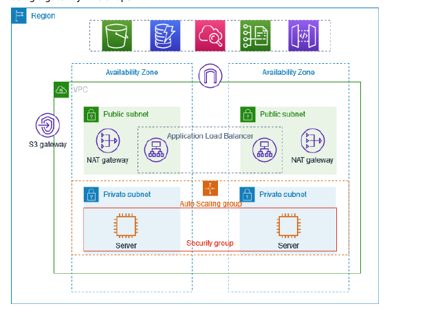
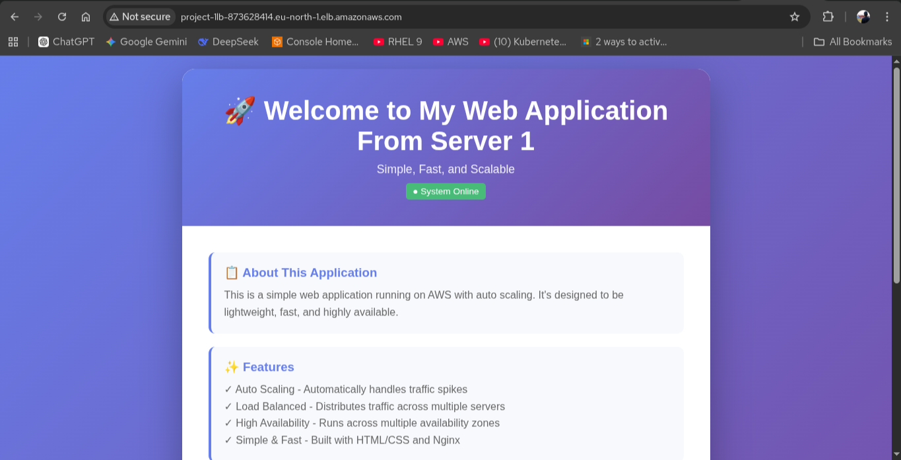
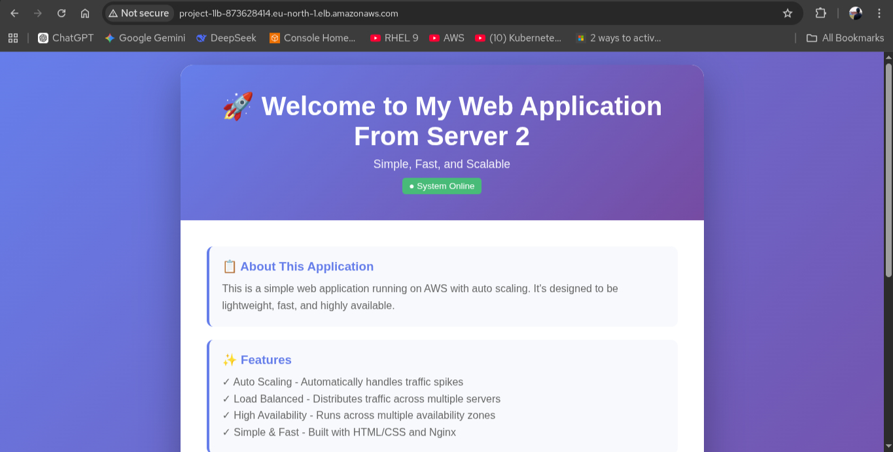

# ☁️ AWS High-Availability Web Infrastructure
### Scalable Two-Tier Architecture with ALB & Auto Scaling

---

## 📖 Project Overview
This project demonstrates a production-ready, **High-Availability (HA)** web architecture deployed on AWS. The goal was to build a system that is **fault-tolerant**, **load-balanced**, and **securely partitioned** across multiple Availability Zones (AZs).

### 🎯 Business Value
* **Zero Downtime:** If one server or AZ fails, the Application Load Balancer (ALB) automatically reroutes traffic to the healthy instance.
* **Automatic Scaling:** The infrastructure scales up or down based on traffic, optimizing performance and cost.
* **Security-First Design:** Web servers are isolated within the VPC, with traffic controlled via Security Group nesting.

---

## 🏗️ Architecture Blueprint
> [!IMPORTANT]
> This architecture uses a **Public-Facing Load Balancer** to manage traffic for **Private-Subnet Web Servers**.

### Core Components:
* **Region:** `eu-north-1` (Stockholm)
* **Networking:** Custom VPC with 4 Subnets (2 Public for ALB, 2 Private for Instances).
* **Compute:** EC2 instances (`t3.micro`) running Amazon Linux.
* **Traffic Management:** * **Application Load Balancer (ALB):** `project-1lb` (Port 80).
    * **Target Group:** `project-1-tg` with active health checks.
* **Scaling:** **Auto Scaling Group (ASG)** ensuring a minimum of 2 healthy instances at all times.

---

## 🛠️ Tech Stack & Tools
| Category | Technology |
| :--- | :--- |
| **Cloud** | AWS (VPC, EC2, ALB, ASG, IAM) |
| **Web Server** | Nginx (Engine-X) |
| **OS** | Amazon Linux 2023 |
| **Security** | Security Groups (Layer 4/7 Firewalls) |

---

## 🚀 Implementation Highlights

### 1. High Availability & Load Balancing
The Application Load Balancer acts as the traffic cop. It listens for HTTP requests and distributes them across two different Availability Zones (`eu-north-1a` and `eu-north-1b`).

**Proof of Health Check:**
| Target ID | Port | Status | AZ |
| :--- | :--- | :--- | :--- |
| `i-01b516b75a45dd4cb` | 80 | ✅ Healthy | eu-north-1a |
| `i-0f94f9766552b6bbf` | 80 | ✅ Healthy | eu-north-1b |

### 2. Live Deployment Results
The following screenshots show the ALB successfully rotating traffic between two different web servers (Round Robin), proving the load-balancing logic is working perfectly.

| Traffic Routed to Server 1 | Traffic Routed to Server 2 |
| :---: | :---: |
|  |  |

---

## ⚙️ How I Built It
1. **Network Layer:** Configured a custom VPC with an Internet Gateway and NAT Gateway for private subnet internet access.
2. **Security Layer:** - Created an **ALB Security Group** (Allowing 80 from 0.0.0.0/0).
   - Created a **Web Security Group** (Allowing 80 **ONLY** from the ALB Security Group ID).
3. **Automation:** Developed a **User Data script** to automate Nginx installation and dynamic HTML page generation upon instance launch.
4. **Resiliency:** Linked the Auto Scaling Group to the ALB Target Group to automate instance replacement.

---

## 📈 Future Enhancements
- [ ] Implement **Route 53** for custom domain mapping.
- [ ] Integrate **AWS Certificate Manager (ACM)** for HTTPS/SSL termination.
- [ ] Use **Terraform** to deploy this entire stack as code (IaC).

---
