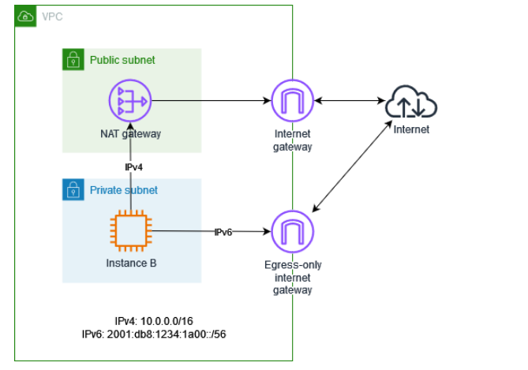
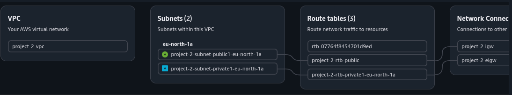
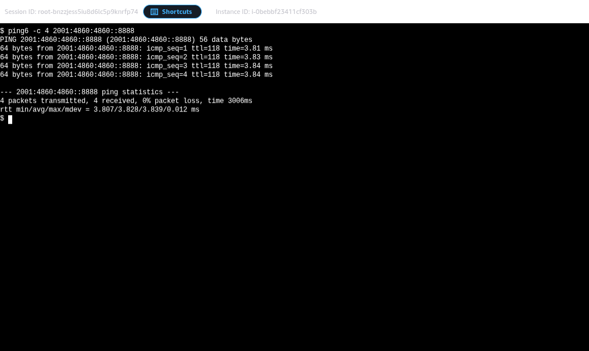

# 🚀 AWS Dual-Stack Hybrid Networking Project

This project demonstrates a highly secure, **Dual-Stack (IPv4/IPv6)** VPC architecture. It focuses on providing controlled internet access to private resources using **NAT Gateway** for IPv4 and **Egress-Only Internet Gateway** for IPv6, ensuring that internal instances can initiate outbound traffic but remain invisible to the public internet.

---

## 🏗️ Architecture Overview

The infrastructure consists of a custom VPC with both public and private subnets across a single Availability Zone (**eu-north-1a**).

### Key Components:
* **VPC:** CIDR `10.0.0.0/16` with Amazon-provided IPv6.
* **Public Subnet:** Hosts the **NAT Gateway** to facilitate IPv4 traffic for private instances.
* **Private Subnet:** Hosts **Instance B (Server)** with no public IPv4 address.
* **Egress-Only Internet Gateway (EIGW):** Provides secure, outbound-only IPv6 connectivity.
* **AWS Systems Manager (SSM):** Used for secure terminal access without needing a Bastion Host or SSH port 22.

---

## 🛠️ Implementation Details

### 1. Networking & Routing
| Traffic Type | Component | Routing Logic |
| :--- | :--- | :--- |
| **IPv4 Outbound** | NAT Gateway | `0.0.0.0/0` -> `nat-07118e9...` |
| **IPv6 Outbound** | Egress-Only IGW | `::/0` -> `eigw-0190bbd...` |
| **Internal** | Local Router | Communication within VPC CIDR |

### 2. Security & Access
* **No Port 22:** Security Groups are hardened. Access is managed via **IAM Roles** and **SSM Managed Instance Core** policy.
* **Egress-Only Protection:** IPv6 traffic is restricted such that no unsolicited inbound connection can reach the private instance.

---

## 🧪 Testing & Verification

### ✅ IPv6 Connectivity (via Egress-Only IGW)
Verified that IPv6 traffic is flowing correctly through the EIGW to external global addresses.
> **Command:** `ping6 -c 4 2001:4860:4860::8888`
> **Result:** 0% packet loss, Avg RTT ~3.8ms.

### ✅ IPv4 Connectivity (via NAT Gateway)
The instance successfully communicates with IPv4 repositories to perform system updates.
> **Command:** `sudo apt update`
> **Result:** Successfully fetched packages from `eu-north-1.ec2.archive.ubuntu.com`.

---

## 📸 Project Evidence (Visualized)

#### 1. VPC Resource Mapping
Visualizing the link between Subnets, Route Tables, and Gateways.

#### 2. IPv6 Connectivity Success
Proof of Egress-Only Gateway functioning correctly from the private instance terminal.

#### 3. Private Outbound IPv4 Update
Instance B updating system packages via NAT Gateway.

---

## 🚀 Skills Demonstrated
* **Cloud Networking:** VPC, Subnetting, Route Tables, IGW, EIGW, NATG.
* **Security:** IAM Roles, Least Privilege Security Groups, Systems Manager (SSM).
* **Linux Admin:** Dual-Stack troubleshooting, Interface configuration, Package management.

---
**Maintained by:** Danish Ali 
**Status:** Completed & Verified ✅
