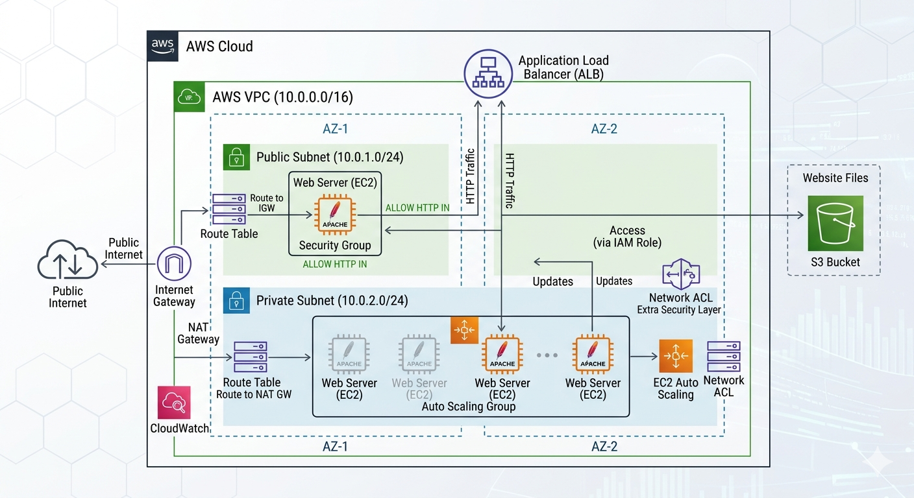
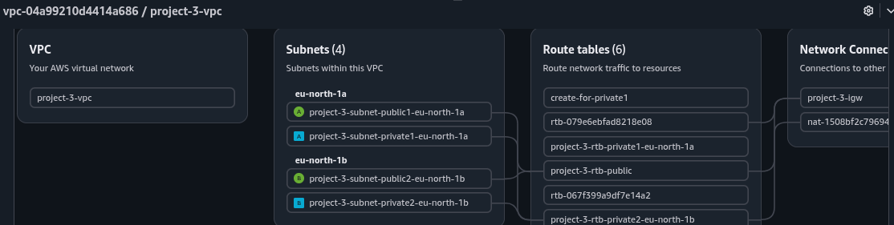
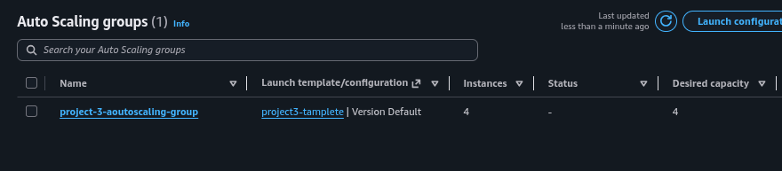
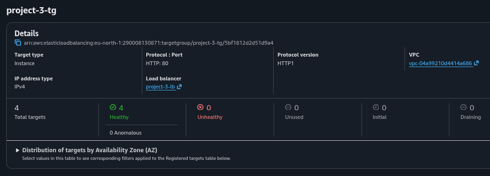
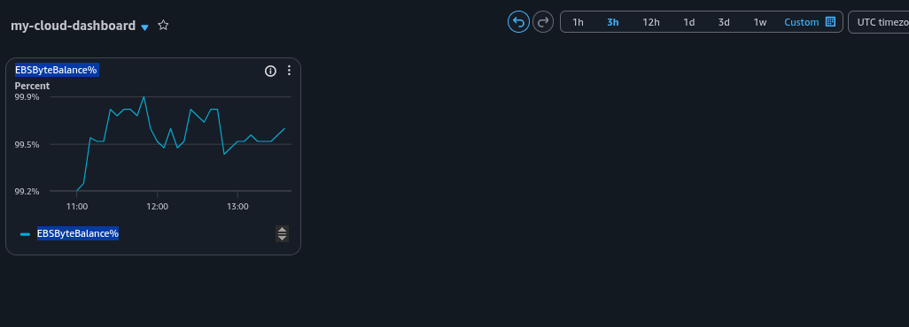
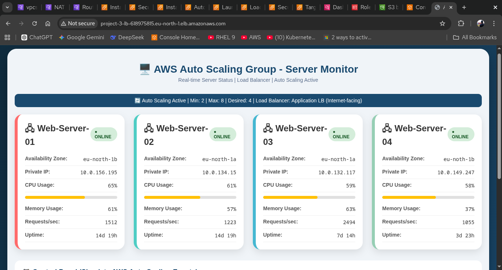

# 🚀 AWS High-Availability & Scalable Two-Tier Architecture

This project demonstrates a production-ready, **Highly Available (HA)** web infrastructure deployed on AWS. It focuses on eliminating single points of failure by using a multi-AZ strategy, automated scaling, and secure network partitioning between public and private tiers.

---

## 🏗️ Architecture Overview

The infrastructure is built in the **eu-north-1 (Stockholm)** region, utilizing two Availability Zones for maximum resilience.

### Visual Blueprint:

*(Is image mein aap VPC, Public/Private Subnets, Load Balancer aur Auto Scaling Group ka pura flow dekh sakte hain)*.

### Key Components:
* **VPC:** Custom VPC (`project-3-vpc`) with a `/16` CIDR block.
* **Public Subnets:** Hosts the **Application Load Balancer (ALB)** and a **Bastion Host** for secure management.
* **Private Subnets:** Houses the **Auto Scaling Group** instances, isolated from direct internet access.
* **External Connectivity:** **NAT Gateway** for private outbound traffic and **Internet Gateway** for public ingress.
* **IAM Security:** Instances use an **IAM Role** with `AmazonS3ReadOnlyAccess` to securely fetch assets from S3 without credentials.

---

## 🛠️ Implementation Details

### 1. Networking & Routing
| Layer | Component | Routing Logic |
| :--- | :--- | :--- |
| **Public** | Internet Gateway | `0.0.0.0/0` -> `project-3-igw` |
| **Private** | NAT Gateway | `0.0.0.0/0` -> `nat-1508bf2...` |
| **Load Balancer** | ALB | Listen on Port 80, Forward to Target Group |

---

## 🧪 Testing & Verification

### ✅ High Availability Test
Verified that traffic is evenly distributed across both `eu-north-1a` and `eu-north-1b`.
> **Result:** All 4 instances are reported as **Healthy** in the Target Group.

### ✅ Load Balancing (Final Output)
The ALB successfully serves the "Server Monitor" dashboard, proving the end-to-end connectivity from the public internet to private instances.
> **Observation:** Real-time metrics show balanced CPU and Memory usage across the fleet.

---

## 📸 Project Evidence (Visualized)

#### 1. VPC Resource Mapping
Visualizing the linkage between Subnets, Route Tables, and Network Gateways.

#### 2. Auto Scaling Group Configuration
Proof of multi-AZ instance management and capacity settings.

#### 3. Target Group Health Status
Confirmation that the ALB is successfully monitoring all 4 backend instances.

#### 4. CloudWatch Observability
Custom dashboard showing performance metrics for the storage layer.

#### 5. Final Live Web Dashboard
The end result: A functional, load-balanced application dashboard.

---

## 🚀 Skills Demonstrated
* **High Availability:** Cross-AZ deployment and Fault Tolerant design.
* **Traffic Management:** ALB configuration, Target Groups, and Health Checks.
* **Automation:** Auto Scaling Groups and Launch Templates.
* **Cloud Security:** Private Networking, NAT Gateways, and IAM Roles.

---
**Maintained by:** Danish Ali  
**Status:** Completed & Verified ✅
