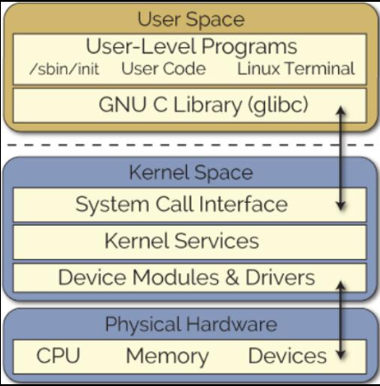
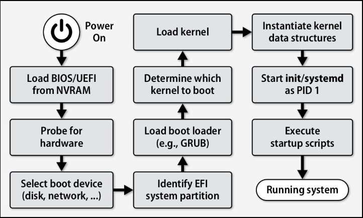
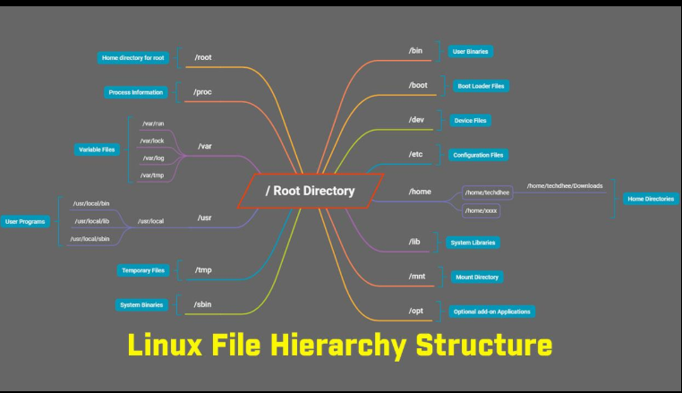

# 🐧 Introduction to Linux & System Administration

A comprehensive repository dedicated to mastering the Linux ecosystem, ranging from core architecture and file system hierarchy to advanced shell scripting and security configurations.

---

## 🏗️ System Architecture & Boot Process

Understanding how hardware communicates with the Kernel and User Space is fundamental to Linux administration.

### Linux Kernel & User Space


### The Boot Process Flow
A step-by-step visualization of the system initialization from Power-on to a running system.


---

## 📂 Linux File System Hierarchy

Mastering the standard directory structure (`/bin`, `/etc`, `/var`, etc.) is crucial for effective system management.



---

## 📚 Course Modules & Topics

This repository contains detailed documentation (PDF/HTML) for the following core modules:

| Module | Focus Area | File Type |
| :--- | :--- | :--- |
| **01-04** | Linux Basics, Booting, & File Hierarchy | PDF |
| **05-09** | Permissions, Shells, Pipes, & Regular Expressions | PDF |
| **10-14** | Vi Editor, Process Mgmt, LVM, RAID, & Scheduling | PDF |
| **15-17** | Package Mgmt, Networking, SSH, & Firewalls | PDF |
| **18-19** | SELinux & Podman Container Management | HTML |

---

## 💻 Bash Scripting Labs

The `Script/Basic` directory contains hands-on automation scripts used for system tasks.

### Practical Implementation


### Script Example: File Reading Automation
```bash
#!/bin/bash
filename=sample.txt
while read -r line; do
    echo "$line"
done < $filename
